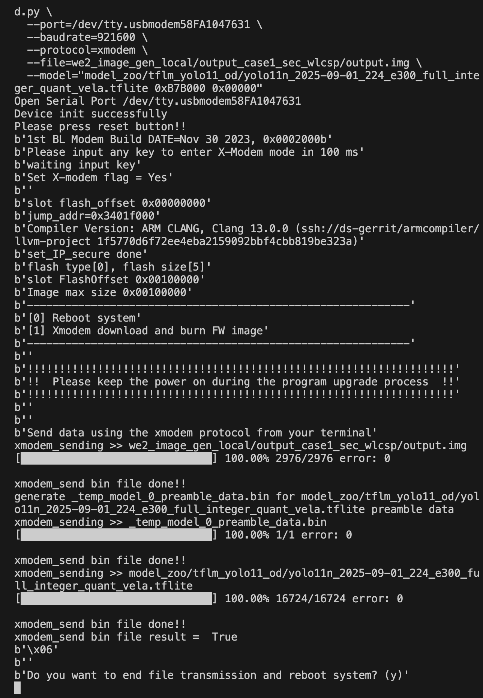
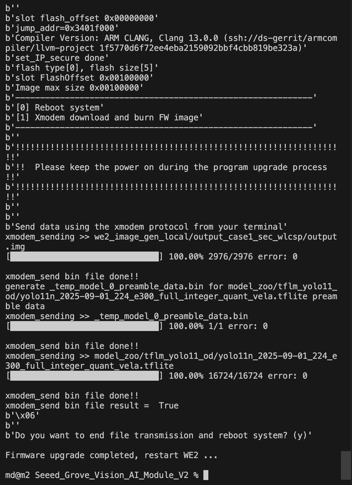
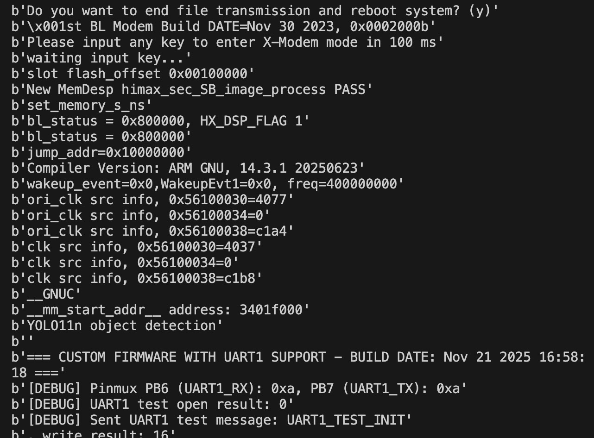
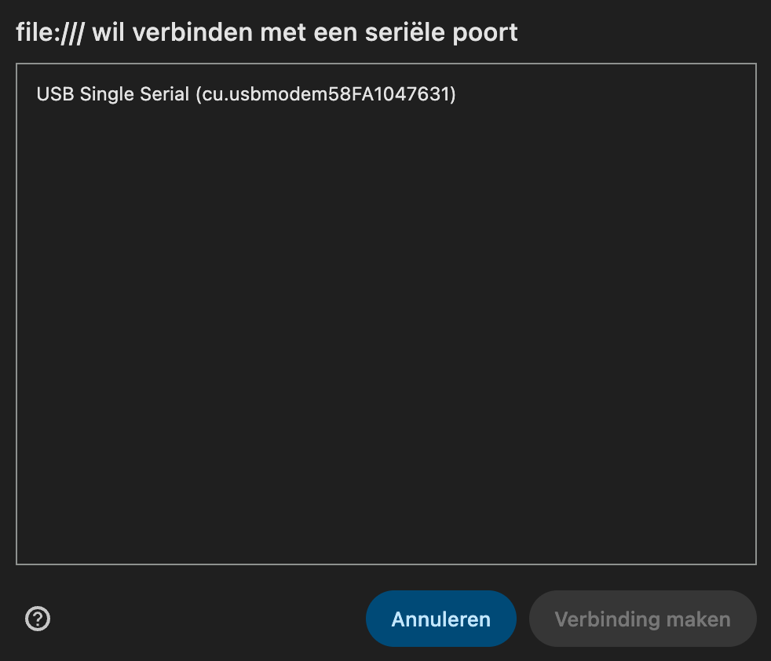
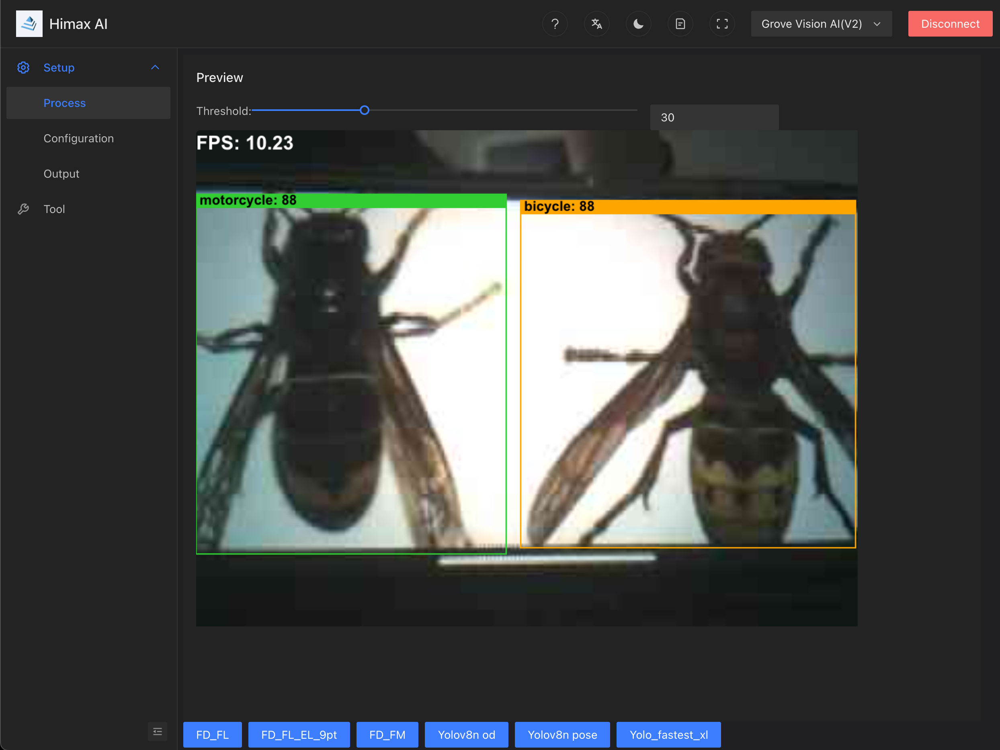
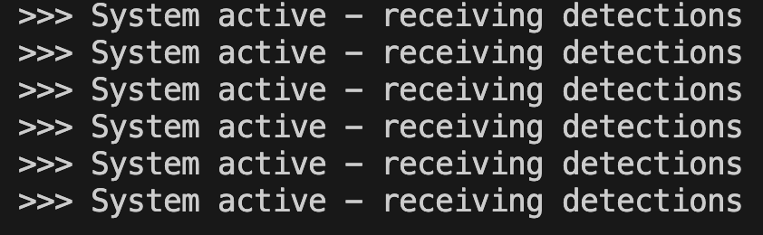

# Vespa velutina detection with Grove Vision AI V2 and esp32-S3

> **Automated detection system for Vespa velutina (Asian - Yellow Legged Hornet) using computer vision. Combines Grove Vision AI V2 for real-time object detection with ESP32-S3 for processing.**

## Goal

This project implements an automated detection system for **Vespa velutina** (Asian hornet) using computer vision. The system uses a **Grove Vision AI V2** module for real-time object detection and an **ESP32-S3** microcontroller to process detection results and control indicator LEDs.

The detection model can identify four classes:
- **Class 0**: Apis mellifera (Honeybee)
- **Class 1**: Vespa crabro (European hornet)
- **Class 2**: Vespula sp. (Yellowjacket)
- **Class 3**: Vespa velutina (Asian hornet) - **Target class**

## Setup Overview

The system consists of two main components:

1. **Grove Vision AI V2**: Performs object detection using a YOLO11n model and sends detection results via UART1 to the ESP32-S3
2. **XIAO ESP32-S3**: Receives detection data, processes it, and controls LEDs to indicate detected species

**Key Features:**
- Real-time object detection with YOLO model
- UART1 communication between Grove Vision AI V2 and ESP32-S3
- Visual feedback via colored LEDs (Red for Vespa velutina, Yellow for other hornets, Green for honeybees)
- Custom firmware with UART1 support for Grove Vision AI V2

---

**Test setup (optional):** For a simple setup via the SenseCraft web platform to test the Grove Vision AI V2, see the [SwiftYOLO Guide](documentation/swift-yolo.md) (192x192px model with UART1 support).

---

## Table of Contents
  * [1 Grove Vision AI V2](#1-grove-vision-ai-v2)
    * [1.1 Install this github repository](#11-install-this-github-repository-gv2-esp32)
    * [1.2 Install Python Dependencies](#12-install-python-dependencies)
    * [1.3 Copy the Custom Firmware Image for the Grove Vision AI V2](#13-copy-the-custom-firmware-image-for-the-grove-vision-ai-v2)
    * [1.4 Copy the YOLO11n Model File](#14-copy-the-yolo11n-model-file)
    * [1.5 Find Your USB Port Name](#15-find-your-usb-port-name)
    * [1.6 Flash the Firmware to the Grove Vision AI V2](#16-flash-the-firmware-to-the-grove-vision-ai-v2)
    * [1.7 Verification](#17-verification)
    * [Troubleshooting](#troubleshooting)
  * [2 ESP32-S3](#2-esp32-s3)
    * [2.1 Install PlatformIO](#21-install-platformio-if-not-already-installed)
    * [2.2 Open the Project in PlatformIO](#22-open-the-project-in-platformio)
    * [2.3 Upload Code to ESP32-S3](#23-upload-code-to-esp32-s3)
    * [2.4 Verification](#24-verification)
* [3 Connection between Grove Vision AI v2 and ESP32-S3](#3-connection-between-grove-vision-ai-v2-and-esp32-s3)

## Getting Started

### 1 Grove Vision AI V2

The Grove Vision AI V2 module needs custom software (firmware) installed so it can send detection results to the ESP32-S3 microcontroller via UART1. This guide shows you how to install the HimaxWiseEyePlus/Seeed_Grove_Vision_AI_Module_V2 repository, and then flash the custom firmware image and the detection model (YOLO11n) that recognizes Asian hornets and look-alikes.


#### Prerequisites

Before starting, you need:

1. **Python 3** installed on your computer
2. **Grove Vision AI V2** module connected to your computer via USB
3. **This repository**

Steps to follow:

1. Clone this repository to your computer
2. [Set up Grove Vision AI V2](#1-grove-vision-ai-v2): flash firmware and model
3. [Set up ESP32-S3](#2-esp32-s3): upload code to ESP32-S3
4. [Connect hardware](#3-connection-between-grove-vision-ai-v2-and-esp32-s3): connect Grove Vision AI V2 and ESP32-S3
5. [Verify the system](#17-verification): test the detection system

#### 1.1: Install this github repository (`gv2-esp32`)

1. Open a terminal (Command Prompt on Windows, Terminal on Mac/Linux)
2. Clone this repository (`gv2-esp32`) to your computer:

   ```bash
   git clone https://github.com/vespCV/gv2-esp32.git
   ```

3. Navigate into the cloned repository:

   ```bash
   cd gv2-esp32
   ```

4. Clone the Himax repository:

   ```bash
   git clone --recursive https://github.com/HimaxWiseEyePlus/Seeed_Grove_Vision_AI_Module_V2.git tools/Seeed_Grove_Vision_AI_Module_V2
   ```

5. Wait for the download to complete. This may take a few minutes.

#### 1.2: Install Python Dependencies

1. Navigate into the repository folder:

   ```bash
   cd tools/Seeed_Grove_Vision_AI_Module_V2
   ```

2. Install the required Python packages:

   ```bash
   pip3 install -r xmodem/requirements.txt
   ```

   **Note:** If you get a "command not found" error, try using `pip` instead of `pip3`, or `python -m pip` instead.

#### 1.3: Copy the Custom Firmware Image for the Grove Vision AI V2

This repository includes a pre-built firmware image (`output.img`) with UART1 support. Copy it from the `images` folder to the Himax repository's output directory.

**Commands to copy the firmware image**

From the project root, copy the firmware with this command:

   **On Mac/Linux:**
   ```bash
   cp images/output.img tools/Seeed_Grove_Vision_AI_Module_V2/we2_image_gen_local/output_case1_sec_wlcsp/output.img
   ```

   **On Windows:**
   ```bash
   copy images\output.img tools\Seeed_Grove_Vision_AI_Module_V2\we2_image_gen_local\output_case1_sec_wlcsp\output.img
   ```

**Note:** This firmware image includes custom modifications to enable UART1 communication. See the [Change Log](documentation/changes.md) for details on the modifications.

#### 1.4: Copy the YOLO11n Model File and Makefile

Copy the model file from the `models` folder and the makefile from the `makefile` folder to the Himax repository.

**Commands** (from the project root):

   **On Mac/Linux:**
   ```bash
   cp models/yolo11n_2025-09-01_224_e300_full_integer_quant_vela.tflite tools/Seeed_Grove_Vision_AI_Module_V2/model_zoo/tflm_yolo11_od/yolo11n_2025-09-01_224_e300_full_integer_quant_vela.tflite
   cp makefile/makefile tools/Seeed_Grove_Vision_AI_Module_V2/EPII_CM55M_APP_S/makefile
   ```

   **On Windows:**
   ```bash
   copy models\yolo11n_2025-09-01_224_e300_full_integer_quant_vela.tflite tools\Seeed_Grove_Vision_AI_Module_V2\model_zoo\tflm_yolo11_od\yolo11n_2025-09-01_224_e300_full_integer_quant_vela.tflite
   copy makefile\makefile tools\Seeed_Grove_Vision_AI_Module_V2\EPII_CM55M_APP_S\makefile
   ```

#### 1.5: Find Your USB Port Name

Before flashing, you need to find the name of the USB port where your Grove Vision AI V2 is connected.

**On Mac:**
1. Open Terminal
2. Run: `ls /dev/cu.usbmodem*`
3. You should see something like `/dev/cu.usbmodem58FA1047631` - copy this exact name

**On Linux:**
1. Open Terminal
2. Run: `ls /dev/ttyACM*` or `ls /dev/ttyUSB*`
3. You should see something like `/dev/ttyACM0` - copy this exact name

**On Windows:**
1. Open Device Manager (search for "Device Manager" in the Start menu)
2. Look under "Ports (COM & LPT)"
3. Find "USB Serial Port" or similar - it will show something like "COM3" or "COM4"
4. Note the COM number (e.g., `COM5`)

#### 1.6: Flash the Firmware to the Grove Vision AI V2

1. Make sure your Grove Vision AI V2 is connected to your computer via USB
2. Close any serial monitor or terminal programs that might be using the USB port
3. Open a terminal and navigate to the repository folder (from the project root):

   ```bash
   cd tools/Seeed_Grove_Vision_AI_Module_V2
   ```

4. Run the flashing command. **Replace only the port name** with your actual USB port name:

   **On Mac/Linux:**
   ```bash
   python3 xmodem/xmodem_send.py \
     --port=/dev/cu.usbmodem###### \
     --baudrate=921600 \
     --protocol=xmodem \
     --file=we2_image_gen_local/output_case1_sec_wlcsp/output.img \
     --model="model_zoo/tflm_yolo11_od/yolo11n_2025-09-01_224_e300_full_integer_quant_vela.tflite 0xB7B000 0x00000"
   ```

   **On Windows:**
   ```powershell
   python xmodem\xmodem_send.py `
     --port COM5 `
     --baudrate 921600 `
     --protocol xmodem `
     --file "we2_image_gen_local\output_case1_sec_wlcsp\output.img" `
     --model "model_zoo\tflm_yolo11_od\yolo11n_2025-09-01_224_e300_full_integer_quant_vela.tflite 0xB7B000 0x00000"
   ```

5. The script will start uploading. 

6. **When you see the message "Send data using the xmodem protocol from your terminal":**
   - **Press the RESET button** on your Grove Vision AI V2 module (black button)
   - Often it will start automatically

7. Wait for the upload to complete. Expected output:
   
   
   
   Or with the updated repository:
   
   

8. After the upload completes, you may be prompted "Do you want to end file transmission and reboot system? (y)". **Pressing 'y' will NOT reset the Grove Vision AI V2.** Instead, **press the RESET button** (black button) on the Grove Vision AI V2 module. The Grove Vision AI V2 will restart and start detecting. Expected output:
   
   

**Note:** Check if you see: === CUSTOM FIRMWARE WITH UART1 SUPPORT - BUILD DATE: Nov 21 2025 16:58:18 ===. If flashing fails, check the xmodem_send.py version. Some recent commits may have issues: https://github.com/HimaxWiseEyePlus/Seeed_Grove_Vision_AI_Module_V2/commits/main/xmodem/xmodem_send.py


**Troubleshooting**

1. To get the Grove Vision AI V2 into boot mode, sometimes you need to:
   - Unplug the board from USB-C
   - Press and hold the boot button (white)
   - Plug in the USB-C cable
   - Press and release the reset button (black)
   - Release the boot button
2. If you do not see `=== CUSTOM FIRMWARE WITH UART1 SUPPORT - BUILD DATE: Nov 21 2025 16:58:18 ===` after flashing, you can try to replace `xmodem_send.py` with the version from this repository. From the project root, run:

   **On Mac/Linux:**
   ```bash
   cp xmodem/xmodem_send.py tools/Seeed_Grove_Vision_AI_Module_V2/xmodem/xmodem_send.py
   ```

   **On Windows:**
   ```bash
   copy xmodem\xmodem_send.py tools\Seeed_Grove_Vision_AI_Module_V2\xmodem\xmodem_send.py
   ```

   Then try flashing again.


#### 1.7: Verification

After flashing is complete:

1. The Grove Vision AI V2 will restart after you press the reset button (pressing 'y' does not work - you must physically press the reset button)
2. You can verify the firmware is working by:
    - Download the [Himax AI web toolkit](https://github.com/HimaxWiseEyePlus/Seeed_Grove_Vision_AI_Module_V2/releases/download/v1.1/Himax_AI_web_toolkit.zip)
    - Unzip `Himax_AI_web_toolkit.zip`
    - Open the Himax_AI_web_toolkit folder and click `index.html`
    - (Optional) Copy the custom JavaScript file to display the correct class names (Apis mellifera, Vespa crabro, Vespula sp., Vespa velutina) instead of the default COCO80 dataset classes (person, car, bicycle, motorcycle, etc.) from the project root:
      
      **On Mac/Linux:**
      ```bash
      cp tools/Seeed_Grove_Vision_AI_Module_V2/index-legacy.51f14f00.js tools/Seeed_Grove_Vision_AI_Module_V2/Himax_AI_web_toolkit/assets/index-legacy.51f14f00.js
      ```
      
      **On Windows:**
      ```bash
      copy tools\Seeed_Grove_Vision_AI_Module_V2\index-legacy.51f14f00.js tools\Seeed_Grove_Vision_AI_Module_V2\Himax_AI_web_toolkit\assets\index-legacy.51f14f00.js
      ```
      
    - Select "Grove Vision AI(V2)", click "connect", choose your USB port
      
    - Point the camera at a test image to see if detection works
      
      


### 2 ESP32-S3

The ESP32-S3 microcontroller needs the detection code uploaded so it can receive detection results from the Grove Vision AI V2 and control the indicator LEDs. This guide shows you how to upload the code using PlatformIO.

#### Prerequisites

Before starting, you need:

1. **PlatformIO IDE** installed on your computer
2. **XIAO ESP32-S3** board connected to your computer via USB-C (for hardware connections, see [Connection Diagram](documentation/connection_diagram.md))
3. **This repository** cloned and set up (see [1.1: Install this github repository](#11-install-this-github-repository-gv2-esp32))

#### 2.1: Install PlatformIO (if not already installed)

**Option A: PlatformIO IDE (Recommended for beginners)**

1. Install [Visual Studio Code](https://code.visualstudio.com/)
2. Open VS Code and go to Extensions (Ctrl+Shift+X / Cmd+Shift+X)
3. Search for "PlatformIO IDE" and click Install
4. Wait for the installation to complete

**Option B: PlatformIO CLI**

**On Mac/Linux:**
```bash
pip3 install platformio
```

**On Windows:**
```bash
pip install platformio
```

#### 2.2: Open the Project in PlatformIO

1. Open PlatformIO IDE (VS Code with PlatformIO extension)
2. Click "Open Project" or use File → Open Folder
3. Navigate to and select the `gv2-esp32` folder (the root of this repository)
4. PlatformIO will automatically detect the `platformio.ini` configuration file

#### 2.3: Upload Code to ESP32-S3

1. Make sure your XIAO ESP32-S3 is connected to your computer via USB-C
2. In PlatformIO IDE, click the **Upload** button (→ arrow icon) in the bottom toolbar, or:
   - Use the keyboard shortcut: `Ctrl+Alt+U` (Windows/Linux) or `Cmd+Option+U` (Mac)
   - Or use the menu: PlatformIO → Upload
3. PlatformIO will:
   - Build the project (compile the code)
   - Upload the firmware to your ESP32-S3
   - Show progress in the terminal

**Alternative: Using PlatformIO CLI**

If you prefer using the command line:

1. Open a terminal in the project root (`gv2-esp32`)
2. Run:
   ```bash
   pio run --target upload
   ```

#### 2.4: Verification

After uploading is complete:

1. The ESP32-S3 will restart automatically. If it doesn't restart, unplug the USB-C cable and reconnect it.
2. On startup, all three LEDs (Green, Yellow, Red) should blink once for 500ms to indicate the system is running.
3. Open the Serial Monitor to see debug output:   - Click the **Serial Monitor** button (plug icon) in PlatformIO IDE   - Or use the keyboard shortcut: `Ctrl+Alt+S` (Windows/Linux) or `Cmd+Option+S` (Mac)   - Or use the menu: PlatformIO → Se
4. Expected output:

      


## 3 Connection between Grove Vision AI v2 and ESP32-S3

For connection diagrams and prototype images, see the [Connection Diagram documentation](documentation/connection_diagram.md).

